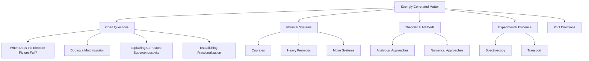

# A Research Map of Strongly Correlated Matter

> Open problems, physical systems, experimental evidence, theoretical methods, and possible PhD directions.

## Purpose

This project is a problem-centered map of strongly correlated matter. Its goals are to:

- identify major open questions and clarify what would count as progress;
- connect experimental observations with competing theoretical interpretations;
- compare the domains, strengths, and limitations of analytical and numerical methods;
- trace how physical questions appear across different material platforms; and
- support an evidence-based choice of PhD research direction.

This is not intended to be a comprehensive textbook or a static literature review. It is a developing record of how my understanding and research judgment evolve.

## How to Navigate

The map will provide several complementary entry points:

| Entry point | Guiding question | Status |
| --- | --- | --- |
| **[Open Questions](questions/README.md)** | What remains unexplained? | Four top-level questions |
| **Physical Systems** | Where does the physics appear? | Planned |
| **Methods** | What can each theoretical tool reliably establish? | Planned |
| **Experiments** | What is directly observed, and how is it interpreted? | Planned |
| **Paper Notes** | Which claims and evidence change the map? | Planned |
| **PhD Directions** | Which problems and working styles fit me? | Planned |

## Field Map

The diagram is deliberately incomplete. It will grow only when new nodes and connections are supported by focused investigation.

## Current Focus

**Topic:** Correlated superconductivity

**Guiding question:** [What would count as a satisfactory explanation of unconventional superconductivity?](questions/correlated-superconductivity.md)

The first investigation will distinguish four related but non-equivalent questions:

1. Why do electrons pair?
2. What determines the symmetry of the paired state?
3. Where does the condensation energy come from?
4. How is superconductivity related to the anomalous normal state?

## Method

Each topic will separate:

- **observations** from experiments;
- **results** from analytical or numerical calculations;
- **interpretations** that connect results to a physical picture;
- **open disputes** for which the available evidence is not decisive; and
- **my current judgment**, including its confidence and possible revisions.

A topic is considered synthesized only when its conclusions have been incorporated into the larger research map.

## Project Status

**Version:** 0.1 — foundation  
**Current stage:** developing the first question page  
**Last updated:** 2026-09-07

## Scope and Limitations

The organization of this project reflects a personal research process. Topic selection, emphasis, and interpretation will therefore be incomplete and may change. Wherever possible, claims will be linked to primary literature or authoritative reviews, and uncertainty will be stated explicitly.
