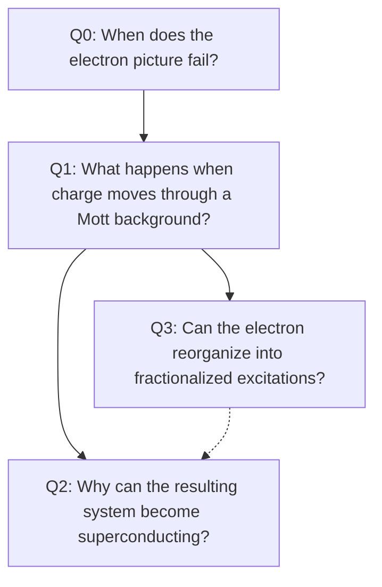

# Top-Level Questions

[← Back to the project homepage](../README.md)

The first phase of this project is organized around four questions. They are not four isolated subfields. Together, they ask how strongly interacting microscopic particles reorganize into new low-energy degrees of freedom, phases, and measurable responses.

The arrows indicate useful conceptual routes, not a unique hierarchy. Correlated superconductivity, heavy-fermion physics, and fractionalization can also arise outside the doped-Mott setting.

## Q0. What Makes a System Strongly Correlated?

### Physical starting point

Interactions can strongly renormalize an electron while leaving an electron-like quasiparticle as the correct low-energy object. A deeper breakdown occurs when low-energy states can no longer be described qualitatively by filling weakly interacting single-particle orbitals.

### Top-level question

When the bare-particle description fails, what are the correct emergent degrees of freedom?

Possible answers include local moments, heavy quasiparticles, collective order parameters, fractionalized excitations, and emergent gauge fields.

### What would count as progress?

A useful principle should connect a microscopic Hamiltonian to its low-energy degrees of freedom, effective theory, phase structure, and observable responses. It should also clarify why a predictive reduction is possible—or why it fails.

### First diagnostic question

> Is a strongly interacting system necessarily a strongly correlated system?

**Status:** Next investigation.

---

## Q1. How Does a Mott Insulator Evolve upon Doping?

### Physical starting point

At half filling and large (U/t), charge motion is suppressed while virtual hopping produces magnetic exchange,

[
J \sim \frac{4t^2}{U}.
]

Doping introduces mobile carriers into this correlated spin background. Their kinetic energy competes with the correlations of the background through which they move.

### Top-level question

What is the nature of a doped charge carrier in a Mott background, and how does the system reorganize to accommodate both charge motion and spin correlations?

### What would count as progress?

A successful account should connect doping to spectral functions, Fermi-surface structure, transport, spin and charge correlations, and the observed competition among pseudogap behavior, charge order, strange-metal transport, and superconductivity.

**Status:** Planned.

---

## Q2. What Would Count as an Explanation of Correlated Superconductivity?

### Physical starting point

A strongly interacting normal state develops a coherent paired state. The phrase *pairing mechanism* can conceal several distinct questions: what drives the pairing instability, what determines the order parameter, where the condensation energy comes from, and how superconductivity relates to the anomalous normal state.

### Top-level question

What must a microscopic theory explain and predict before it constitutes a satisfactory account of correlated superconductivity?

### What would count as progress?

A successful theory should connect a microscopic model to a pairing tendency, the structure of the superconducting state, observable responses, and quantitative tests that discriminate it from competing descriptions.

[Read the seed question page →](correlated-superconductivity.md)

**Status:** Active.

---

## Q3. How Can Fractionalization Be Established?

### Physical starting point

In some many-body theories, the quantum numbers carried together by an electron appear in distinct low-energy excitations. Fractionalization is therefore a statement about the organization of the many-body spectrum, not the mechanical splitting of a microscopic electron.

### Top-level question

What combination of theoretical predictions and experimental evidence can establish fractionalized excitations in a real system while excluding conventional alternatives?

### What would count as progress?

Evidence should go beyond compatibility with one anomalous signal. Ideally, several independent probes should agree; conventional explanations such as disorder, phonons, multimagnon continua, or strong damping should be tested; and the proposed theory should predict additional discriminating responses.

**Status:** Planned.

---

## A Common Template

Each question will be developed through four prompts:

| Prompt | Purpose |
| --- | --- |
| **Concrete phenomenon** | What is actually observed or calculated? |
| **Failure of the simple picture** | Where does an electron or quasiparticle description fail? |
| **Candidate new structure** | What emergent degrees of freedom or organizing principles are proposed? |
| **Decisive test** | What evidence could distinguish competing explanations? |

## Scope of the First Phase

These four questions form the initial map, not a claim that they exhaust strongly correlated matter. Strange metals, quantum criticality, heavy fermions, correlated topology, nonequilibrium dynamics, and predictive many-body methods will first appear as connections or subquestions. They can become top-level investigations if the first phase shows that they require independent treatment.

## Starting Reference

A. Alexandradinata *et al.*, “The Future of the Correlated Electron Problem,” [arXiv:2010.00584](https://arxiv.org/abs/2010.00584).
